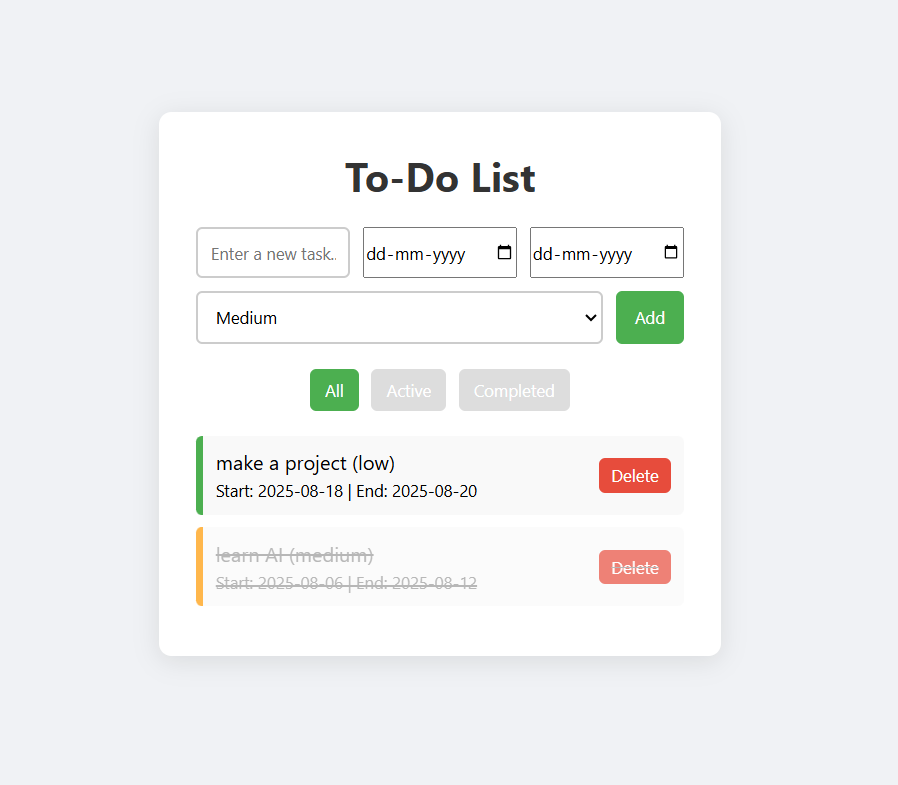

# To-Do List with Priority

A simple and clean to-do list web app built with HTML, CSS, and JavaScript. Easily add, prioritize, filter, and manage your daily tasks.

## Features
- Add tasks with three priority levels: Low, Medium, High
- Add a start date and end date for every task
- Mark tasks as completed or active
- Filter tasks by All, Active, or Completed
- Responsive and user-friendly interface
- All data is stored in your browser (no backend required)

## How to Use
1. Open `index.html` in your web browser.
2. Enter a new task in the input field.
3. Select a start date and end date for the task.
4. Select a priority (Low, Medium, High).
5. Click the **Add** button to add the task to your list.
6. Use the filter buttons to view all, active, or completed tasks.
7. Click on a task to mark it as completed or active.
8. (Optional) Delete a task using the delete button next to it.

## Technologies Used
- HTML5
- CSS3
- Vanilla JavaScript

## Customization
- You can modify the styles in `style.css` to change the look and feel.
- The main logic is in `script.js`.

## Screenshot

---

**Author:** Kratagya Verma

Feel free to use, modify, and share this project!
